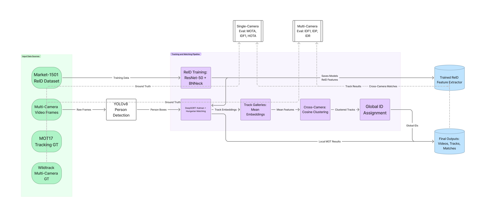
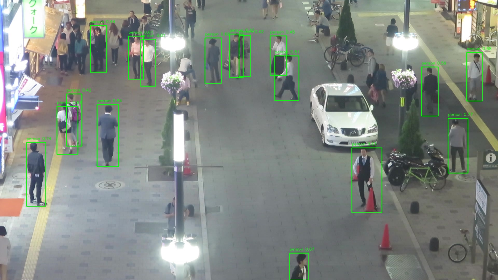
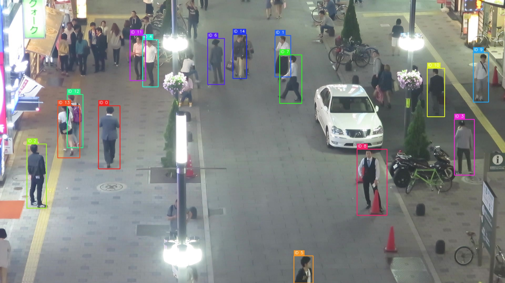
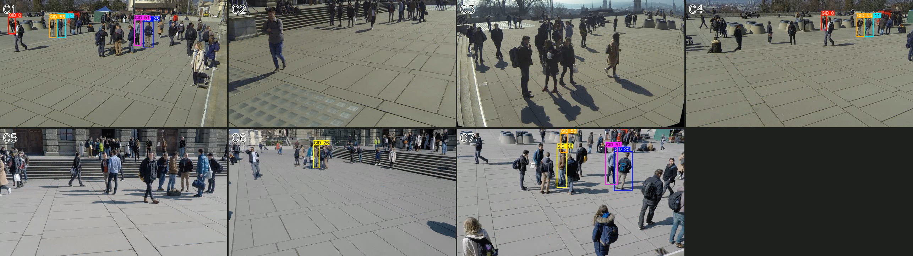

# MCTrack: Multi-Camera Object Tracking with Person Re-Identification

**MSML 640 (Computer Vision) Final Project — Group 9**
University of Maryland, Spring 2026

| Member                 | UID       |
| ---------------------- | --------- |
| Chanakya Chelamkuri    | 121305602 |
| Vineet Jujjavarapu     | 121322340 |
| Manoj Kumar Bashaboina | 121333377 |

---

## Overview

End-to-end multi-camera pedestrian tracking system with five components:

1. **Person detection** — pre-trained YOLOv8m, person class only
2. **Single-camera tracking** — SORT (motion only) and DeepSORT (motion +
   appearance), built from scratch with Kalman filter and Hungarian assignment
3. **Re-identification** — ResNet-50 + BNNeck embedding model, trained from
   scratch on Market-1501 with combined cross-entropy and triplet loss
4. **Ground-plane filtering** — uses Wildtrack camera calibrations to project
   bbox foot points onto the ground plane and exclude detections outside the
   annotated zone
5. **Cross-camera matching** — clusters per-camera tracks by appearance
   embedding to assign global identities across views

The trained Re-ID model is hosted on Hugging Face for direct access.

- **Trained model:** https://huggingface.co/blank4hd/mctrack-reid
- **Demo videos:** submitted separately as the video demonstration

---

## Architecture Diagram



## Quick Demo (4 steps, ~30 seconds)

This demonstrates the trained Re-ID model on two example pedestrian images.
**No datasets required.** The model is downloaded automatically from
Hugging Face on first run.

**Step 1.** Unzip or clone this repository.

**Step 2.** `cd` into the project directory.

**Step 3.** Make the demo script executable:

```bash
chmod +x demo.sh
```

**Step 4.** Run the demo:

```bash
bash demo.sh
```

### Expected output

```
==================================================================
  MCTrack Re-ID Demo
  MSML 640 Final Project — Group 9
==================================================================

[1/3] Creating Python virtual environment...
[2/3] Installing dependencies...
[3/3] Running Re-ID demo...

Loading Re-ID model...
  Downloading model from blank4hd/mctrack-reid (cached after first run)...
  Model loaded: 25.6M parameters, 256-dim embeddings

Comparing:
  Image A: examples/person_a.jpg
  Image B: examples/person_b.jpg

----- Result -----
  Cosine similarity: 0.7XXX
  Verdict:           Likely SAME person
------------------
```

The two example images are crops of the same Market-1501 pedestrian
captured by two different cameras. Same-person pairs typically score
0.5–0.85 similarity; different-person pairs score below 0.3.

### Testing the model with different person but looking similar

```bash
source demo_env/bin/activate
python3 demo_inference.py --image-a examples/person_a.jpg --image-b examples/pair2_a.jpg
```

### Compare your own images

After `demo.sh` runs once, the virtual environment persists. Test any
two pedestrian crops:

```bash
source demo_env/bin/activate
python3 demo_inference.py --image-a path/to/A.jpg --image-b path/to/B.jpg
```

### Requirements

- Python 3.10 or newer
- ~500 MB free disk space (dependencies + cached model)
- Internet (only on first run, to download the model)
- No GPU required — runs on CPU

---

## What's in This Repository

```
.
├── README.md                   # This file
├── demo.sh                     # One-command demo runner
├── demo_inference.py           # Standalone Re-ID inference script
├── examples/                   # Demo images (Market-1501 crops)
│   ├── person_a.jpg
│   └── person_b.jpg
├── pyproject.toml              # Full project dependencies
├── src/                        # Project source code
│   ├── detection/              # YOLOv8m wrapper
│   ├── tracking/               # Kalman, Hungarian, SORT, DeepSORT
│   ├── reid/                   # ResNet-50 + BNNeck, training, evaluation
│   ├── cross_camera/           # Calibrations, ground-plane filter, matcher
│   ├── evaluation/             # TrackEval integration
│   └── utils/                  # Device selection helpers
├── scripts/                    # CLI entry points (training, evaluation, video)
├── tests/                      # Unit tests
├── huggingface/                # Standalone Re-ID loader (mirror of HF repo)
└── outputs/                    # Saved predictions and evaluation summaries
```

---

## Performance Summary

### Re-ID — Market-1501

| Variant              | mAP  | Rank-1 | Rank-5 |
| -------------------- | ---- | ------ | ------ |
| 60-epoch (deployed)  | 73.7 | 89.3   | 96.0   |
| 120-epoch (ablation) | 75.2 | 90.7   | 96.8   |

### Single-camera tracking — MOT17

| Tracker                 | HOTA | MOTA | IDF1 | IDSW |
| ----------------------- | ---- | ---- | ---- | ---- |
| SORT (motion only)      | 39.6 | 35.3 | 46.8 | 290  |
| DeepSORT (60-ep Re-ID)  | 41.1 | 36.5 | 48.6 | 260  |
| DeepSORT (120-ep Re-ID) | 41.0 | 36.6 | 48.8 | 246  |

### Cross-camera matching — Wildtrack

| Configuration             | IDF1 | IDP  | IDR  |
| ------------------------- | ---- | ---- | ---- |
| Baseline (no filter)      | 14.7 | 16.3 | 13.4 |
| + Ground-plane filter     | 17.0 | 23.8 | 13.2 |
| + 120-epoch Re-ID retrain | 18.7 | 26.4 | 14.5 |

---

## Reproducing the Full Pipeline (SKIP THIS STEP:TIME CONSUMING)

The quick demo above does not require any datasets and is sufficient for
grading. This section documents how to reproduce the full training and
evaluation pipeline, who want to verify the numbers in the
performance tables.

### Datasets required (in GB sizes)

The three datasets must be downloaded separately:

| Dataset     | Use                               | Source                                              |
| ----------- | --------------------------------- | --------------------------------------------------- |
| MOT17       | Single-camera tracking evaluation | https://motchallenge.net/data/MOT17/                |
| Wildtrack   | Multi-camera evaluation           | https://www.epfl.ch/labs/cvlab/data/data-wildtrack/ |
| Market-1501 | Re-ID training and evaluation     | https://www.kaggle.com/datasets/pengcw1/market-1501 |

Place them under `data/` matching this structure:

```
data/
├── MOT17/train/MOT17-{02,04,05,09,10,11,13}-FRCNN/img1/
├── Wildtrack/
│   ├── Image_subsets/{C1..C7}/
│   ├── annotations_positions/
│   └── calibrations/{intrinsic_zero,extrinsic}/
└── Market-1501-v15.09.15/
    ├── bounding_box_train/
    ├── bounding_box_test/
    └── query/
```

### Setup

Install the full project dependencies (separate from the demo's lightweight
environment):

```bash
pip install -e ".[dev]"
```

This installs PyTorch, Ultralytics (YOLOv8), TrackEval, and other tools
needed for training and evaluation.

### Step 1 — Train the Re-ID model (optional)

This step trains the deployed 60-epoch Re-ID model from scratch on
Market-1501. **You can skip this step** and use the trained model from
Hugging Face for all downstream steps; everything below works either way.

```bash
python3 scripts/train_reid.py \
    --epochs 60 \
    --eval-every 5 \
    --output-dir outputs/reid
```

Output: `outputs/reid/best.pth` (the model checkpoint), and
`outputs/reid/train_log.csv` (per-epoch loss and validation metrics).

To also reproduce the 120-epoch ablation:

```bash
python3 scripts/train_reid.py \
    --epochs 120 \
    --eval-every 10 \
    --output-dir outputs/reid_120ep
```

### Step 2 — Evaluate the Re-ID model on Market-1501

Computes mAP and Rank-{1,5,10} on the Market-1501 test set.

```bash
python3 scripts/evaluate_reid.py \
    --checkpoint outputs/reid/best.pth
```

Expected output: mAP ~73.7, Rank-1 ~89.3 (matches the table above).

### Step 3 — Run single-camera tracking on MOT17

The report compares three tracker variants on all 7 MOT17 train sequences.
Run them in sequence; each saves to a separate output directory.

**Variant A — SORT (motion only, no Re-ID):**

```bash
python3 scripts/run_all_sequences.py \
    --tracker sort \
    --output-dir outputs/predictions/SORT
```

**Variant B — DeepSORT with 60-epoch Re-ID (deployed model):**

```bash
python3 scripts/run_all_sequences.py \
    --tracker deepsort \
    --reid-checkpoint outputs/reid/best.pth \
    --output-dir outputs/predictions/DeepSORT_v2 \
    --appearance-thresh 0.25
```

**Variant C — DeepSORT with 120-epoch Re-ID (ablation):**

```bash
python3 scripts/run_all_sequences.py \
    --tracker deepsort \
    --reid-checkpoint outputs/reid_120ep/best.pth \
    --output-dir outputs/predictions/DeepSORT_v3 \
    --appearance-thresh 0.25
```

Each run produces 7 MOT-format prediction text files (one per sequence)
in the chosen output directory.

### Step 4 — Evaluate MOT17 tracking with TrackEval

Run TrackEval on each tracker's predictions. The summary tables
(HOTA, MOTA, IDF1, IDSW) are written to `outputs/trackeval/`.

```bash
python3 scripts/evaluate.py \
    --predictions-dir outputs/predictions/SORT \
    --tracker-name SORT \
    --output-root outputs/trackeval

python3 scripts/evaluate.py \
    --predictions-dir outputs/predictions/DeepSORT_v2 \
    --tracker-name DeepSORT_v2 \
    --output-root outputs/trackeval

python3 scripts/evaluate.py \
    --predictions-dir outputs/predictions/DeepSORT_v3 \
    --tracker-name DeepSORT_v3 \
    --output-root outputs/trackeval
```

Each command prints the per-sequence and overall metrics. The expected
overall numbers match the MOT17 table above.

### Step 5 — Run per-camera tracking on Wildtrack

The Wildtrack pipeline runs DeepSORT independently on each of the 7 cameras,
optionally filtering predictions to the annotated zone using camera
calibrations.

**Variant A — Baseline (no ground-plane filter, 60-epoch Re-ID):**

```bash
python3 scripts/run_wildtrack_per_camera.py \
    --reid-checkpoint outputs/reid/best.pth \
    --output-dir outputs/wildtrack/per_camera
```

**Variant B — With ground-plane filter, 60-epoch Re-ID:**

```bash
python3 scripts/run_wildtrack_per_camera.py \
    --reid-checkpoint outputs/reid/best.pth \
    --output-dir outputs/wildtrack/per_camera_gp \
    --ground-plane-filter
```

**Variant C — With ground-plane filter, 120-epoch Re-ID:**

```bash
python3 scripts/run_wildtrack_per_camera.py \
    --reid-checkpoint outputs/reid_120ep/best.pth \
    --output-dir outputs/wildtrack/per_camera_final \
    --ground-plane-filter
```

Each variant produces 7 prediction files (`C1.txt` through `C7.txt`) plus
`.npz` files containing the appearance embeddings used for cross-camera
matching.

### Step 6 — Evaluate cross-camera matching on Wildtrack

Sweeps a range of similarity thresholds and reports IDF1 / IDP / IDR for
each. The optimal threshold and corresponding IDF1 are the headline numbers
in the cross-camera table.

```bash
python3 scripts/evaluate_wildtrack.py \
    --per-camera-dir outputs/wildtrack/per_camera \
    --sweep 0.25 0.30 0.35 0.40 0.45 \
    --output outputs/wildtrack/sweep_baseline.txt

python3 scripts/evaluate_wildtrack.py \
    --per-camera-dir outputs/wildtrack/per_camera_gp \
    --sweep 0.25 0.30 0.35 0.40 0.45 \
    --output outputs/wildtrack/sweep_gp.txt

python3 scripts/evaluate_wildtrack.py \
    --per-camera-dir outputs/wildtrack/per_camera_final \
    --sweep 0.25 0.30 0.35 0.40 0.45 \
    --output outputs/wildtrack/sweep_final.txt
```

Expected best-threshold IDF1 values: 14.7 (baseline), 17.0 (with filter),
18.7 (with filter + 120-ep Re-ID).

### Step 7 — Render demo videos

These commands render the annotated videos used in the submitted
demonstration video. They are not required to verify quantitative results.

**Single-camera demo (MOT17):**

```bash
python3 scripts/make_mot17_video.py \
    --sequence MOT17-04-FRCNN \
    --predictions outputs/predictions/DeepSORT_v3 \
    --output outputs/mot17_demo_MOT17-04-FRCNN.mp4
```

**Multi-camera demo (Wildtrack):**

```bash
python3 scripts/make_wildtrack_video.py \
    --per-camera-dir outputs/wildtrack/per_camera_final \
    --output outputs/wildtrack/cross_camera_demo.mp4 \
    --start-frame 5 \
    --threshold 0.40
```

---

## Sample Outputs

### Detection



### Single Camera Tracking



### Multi Camera Tracking



---

## Hosted Artifacts

**Trained Re-ID model:** https://huggingface.co/blank4hd/mctrack-reid

Two checkpoints are available:

- `best_60ep.pth` — primary model (used by the demo)
- `best_120ep.pth` — 120-epoch retrain (ablation)

The model card on Hugging Face includes architecture, training details,
performance numbers, and standalone usage instructions.

---

## Limitations and Honest Notes

A few honest observations from the measured performance:

- **Detection recall is the bottleneck.** With ~67k false negatives on
  MOT17 (vs ~3.8k false positives), detection misses limit MOTA and IDF1
  regardless of tracker quality.
- **Cross-camera IDF1 is modest (18.7%).** Wildtrack's annotated zone is
  smaller than the cameras' field of view. The ground-plane filter
  substantially reduces but does not eliminate predictions outside the
  zone. Published Wildtrack baselines use multi-view detection fusion,
  which is outside our scope.
- **Re-ID generalization.** The model was trained on Market-1501 (Tsinghua
  University campus). Performance on cross-domain settings (e.g., Wildtrack)
  is harder to bound; we report what we measured.

---

## Acknowledgments

- ResNet-50 + BNNeck architecture: Luo et al., _Bag of Tricks and a Strong
  Baseline for Deep Person Re-Identification_ (CVPRW 2019)
- Triplet loss: Hermans et al., _In Defense of the Triplet Loss for Person
  Re-Identification_ (arXiv 2017)
- DeepSORT: Wojke et al., _Simple Online and Realtime Tracking with a Deep
  Association Metric_ (ICIP 2017)
- Datasets: MOT17 (Milan et al.), Wildtrack (Chavdarova et al.), Market-1501
  (Zheng et al.)
- TrackEval evaluation library
